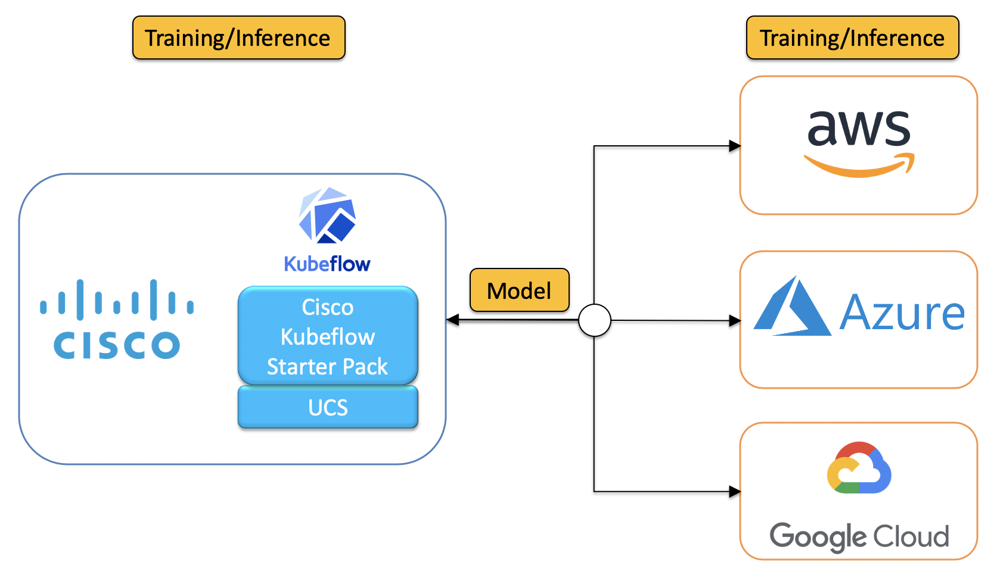

The Cisco Kubeflow Starter Pack can also be run in a hybrid model in which training could be done on on-premise infrastructure whereas 
serving/inference could be done on the cloud. A hybrid model is probably
the most realistic since enterprises usually do not want to transfer 
proprietary sensitive data to the cloud. Hence, using a hybrid model, 
the training of the ML models could be done where the data resides,
i.e., on-premise and the inference (serving) could be done in the cloud
thus taking advantage of the scalability and reliability provided by
cloud providers. Of course the inverse can also be done, i.e., the
training could be done in the cloud and the inference could be done
on-premise.

A schematic of the hybrid cloud model is shown in the above picture.