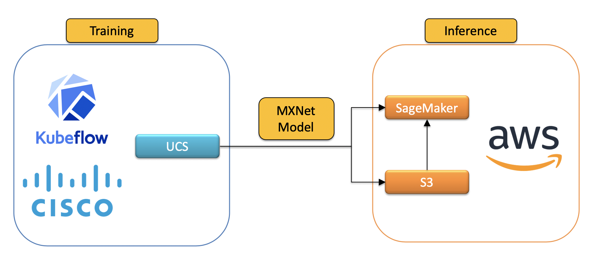
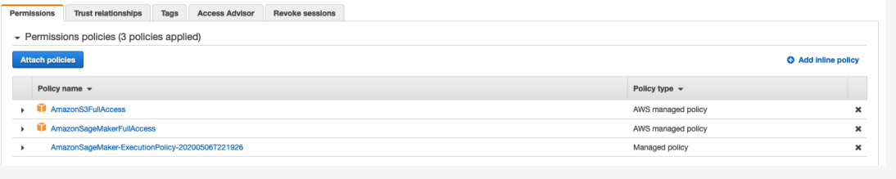
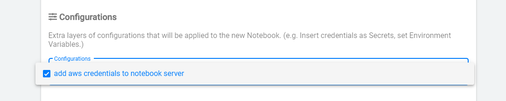
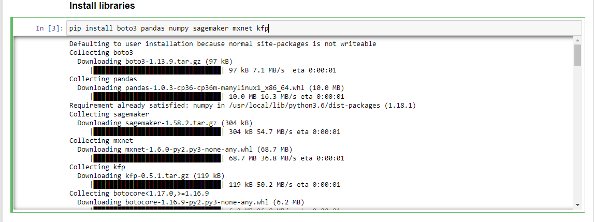
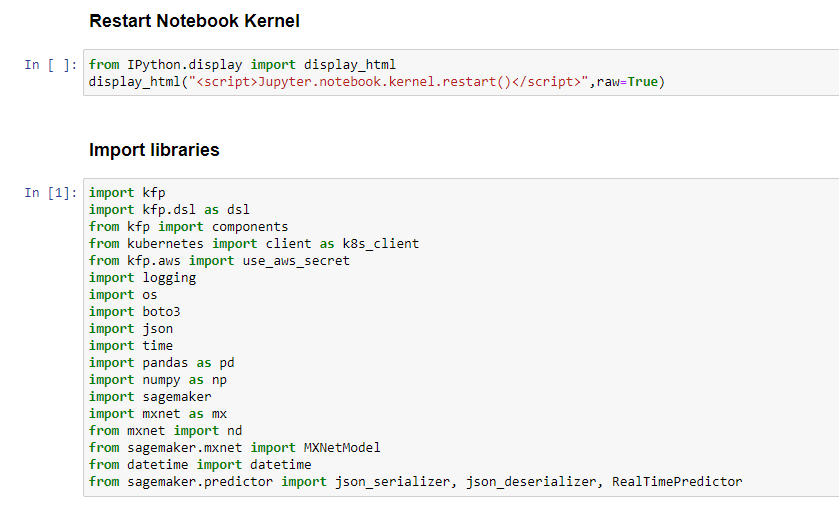
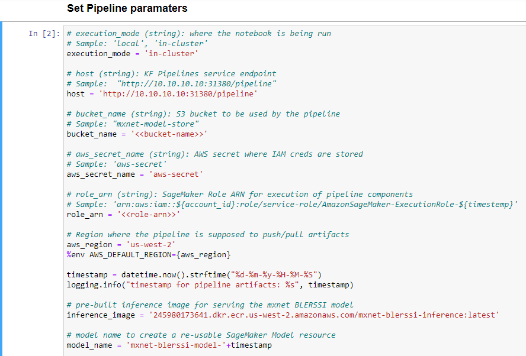
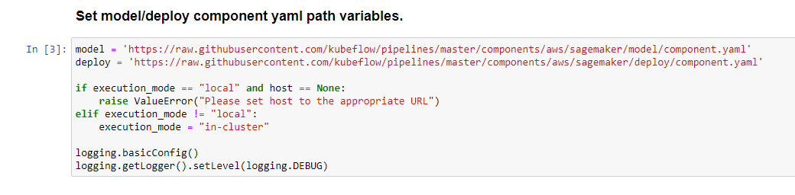

# BLE-RSSI Hybrid Pipeline using Cisco UCS 🤝 Amazon SageMaker

<!-- vscode-markdown-toc -->
* [Problem Definition](#ProblemDefinition)
* [Prerequisites](#Prerequisites)
* [Solution Schematic](#SolutionSchematic)
* [AWS Setup](#AWSSetup)
	* [Create S3 Bucket](#CreateS3Bucket)
	* [Setup SageMaker permissions](#SetupSageMakerpermissions)
* [UCS Setup](#UCSSetup)
	* [Retrieve Ingress IP](#RetrieveIngressIP)
* [Pipeline Workflow](#PipelineWorkflow)
	* [Create Jupyter Notebook Server](#CreateJupyterNotebookServer)
	* [Upload Hybrid Pipeline notebook](#UploadHybridPipelinenotebook)
	* [Run Pipeline](#RunPipeline)
	* [Building inference image](#Buildinginferenceimage)
	* [Run Prediction API](#RunPredictionAPI)

<!-- vscode-markdown-toc-config
	numbering=false
	autoSave=true
	/vscode-markdown-toc-config -->
<!-- /vscode-markdown-toc -->

## <a name='ProblemDefinition'></a>Problem Definition
The description of the BLE-RSSI based location prediction problem
can be found [here](../../README.md).

## <a name='Prerequisites'></a>Prerequisites

- [ ] UCS machine with Kubeflow 1.0 installed
- [ ] AWS account with appropriate permissions

## <a name='SolutionSchematic'></a>Solution Schematic



The overall solution uses [Kubeflow](https://www.kubeflow.org/) to run
the training on [Cisco UCS](https://www.cisco.com/c/en_in/products/servers-unified-computing/index.html) servers and the model is then served via [Amazon SageMaker](https://aws.amazon.com/sagemaker/).

## <a name='AWSSetup'></a>AWS Setup
### <a name='CreateS3Bucket'></a>Create S3 Bucket

Ensure you have the AWS CLI installed. 
Otherwise, you can use the docker image with the alias set.

    alias aws='docker run --rm -it -v ~/.aws:/root/.aws -v $(pwd):/aws amazon/aws-cli'
    aws s3 mb s3://mxnet-model-store --region us-west-2

### <a name='SetupSageMakerpermissions'></a>Setup SageMaker permissions

In order to run this pipeline, we need to prepare an IAM Role to run Sagemaker jobs. You need this `role_arn` to run a pipeline. Check [here](https://docs.aws.amazon.com/sagemaker/latest/dg/sagemaker-roles.html) for details.

Attach AmazonS3FullAccess and AmazonSageMakerFullAccess policies with IAM Role.




Pipeline and notebook uses aws-secret to get access to Sagemaker services

Make sure you have  `aws-secret` in kubeflow and anonymous namespace.

    echo -n $AWS_ACCESS_KEY_ID | base64
    echo -n $AWS_SECRET_ACCESS_KEY | base64

```yaml
apiVersion: v1
kind: Secret
metadata:
  name: aws-secret
type: Opaque
data:
  AWS_ACCESS_KEY_ID: YOUR_BASE64_ACCESS_KEY
  AWS_SECRET_ACCESS_KEY: YOUR_BASE64_SECRET_ACCESS
```
Apply this yaml in kubeflow and anonymous namespace

```
kubectl apply -f aws-secret.yaml -n kubeflow
kubectl apply -f aws-secret.yaml -n anonymous
```
To configure aws-secrets to kubeflow notebook server, create kind `PodDefault` in anonymous namespace

```yaml
apiVersion: "kubeflow.org/v1alpha1"
kind: PodDefault
metadata:
  name: add-aws-secret
spec:
 selector:
  matchLabels:
    add-aws-secret: "true"
 desc: "add aws credentials to notebook server"
 volumeMounts:
 - name: secret-volume
   mountPath: /secret/gcp
 volumes:
 - name: secret-volume
   secret:
    secretName: aws-secret
 env:
 - name: AWS_ACCESS_KEY_ID
   valueFrom:
     secretKeyRef:
       name: aws-secret
       key: AWS_ACCESS_KEY_ID
 - name: AWS_SECRET_ACCESS_KEY
   valueFrom:
     secretKeyRef:
       name: aws-secret
       key: AWS_SECRET_ACCESS_KEY
```
Apply this yaml in anonymous namespace

```
kubectl apply -f add-aws-secret.yaml -n anonymous
```

## <a name='UCSSetup'></a>UCS Setup

To install Kubeflow, follow the instructions [here](../../../../../install)

### <a name='RetrieveIngressIP'></a>Retrieve Ingress IP

For installation, we need to know the external IP of the 'istio-ingressgateway' service. This can be retrieved by the following steps.  

```
kubectl get service -n istio-system istio-ingressgateway
```

If your service is of LoadBalancer Type, use the 'EXTERNAL-IP' of this service.  

Or else, if your service is of NodePort Type - run the following command:  

```
kubectl get nodes -o wide
```

Use either of 'EXTERNAL-IP' or 'INTERNAL-IP' of any of the nodes based on which IP is accessible in your network.  

This IP will be referred to as INGRESS_IP from here on.

## <a name='PipelineWorkflow'></a>Pipeline Workflow
Once the setup is complete, the following are the steps in the pipeline
workflow.

### <a name='CreateJupyterNotebookServer'></a>Create Jupyter Notebook Server

Add configuration as given below to attach aws-secrets while creating new notebook server



Follow the [steps](./../notebook#create--connect-to-jupyter-notebook-server) to create & connect to Jupyter Notebook Server in Kubeflow    
### <a name='UploadHybridPipelinenotebook'></a>Upload Hybrid Pipeline notebook

Upload [blerssi-aws.ipynb](blerssi-aws.ipynb) file to the created Notebook server.
    
### <a name='RunPipeline'></a>Run Pipeline

Open the [blerssi-aws.ipynb](blerssi-aws.ipynb) file and run pipeline

Install required libraries



Restart kernel and Import libraries 



:information_source: 
### <a name='Buildinginferenceimage'></a>Building inference image
  
   Run build & push script [here](./components/v1/mxnet-byom-inference/container/build_and_push.sh) using your *account credentials*.

Set AWS region, and inference image to the built ECR image

Set other pipeline parameters 



Set model/deploy component yaml path variables.



Define BLERSSI mxnet pipeline function


Create experiment with name "BLERSSI-Sagemaker"


Create BLERSSI run and open run link


The BLERSSI Sagemaker pipeline starts executing. 
Once all the components executed successfully, check the logs of sagemaker-deploy component to verify endpoint is created.


To verify endpoint in AWS, open AWS sagemaker and check endpoints created successfully as snapshot given below


### <a name='RunPredictionAPI'></a>Run Prediction API

To predict the output go back to jupyter notebook and start executing other cells

Check endpoint status


Predicted result will be displayed


