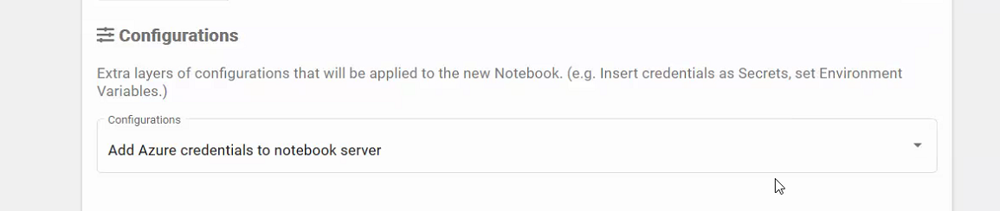
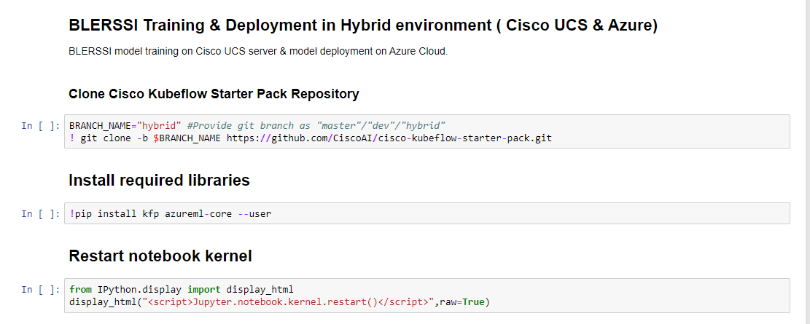
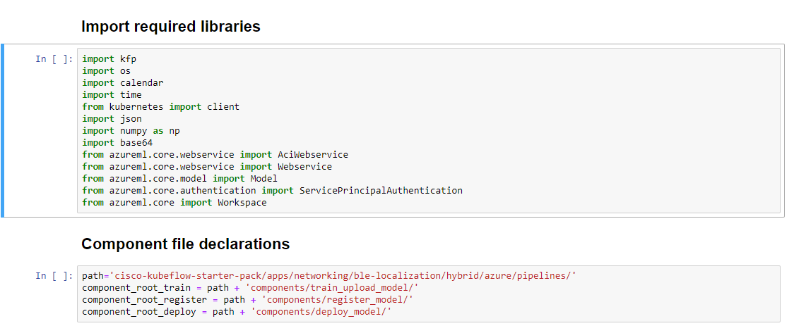
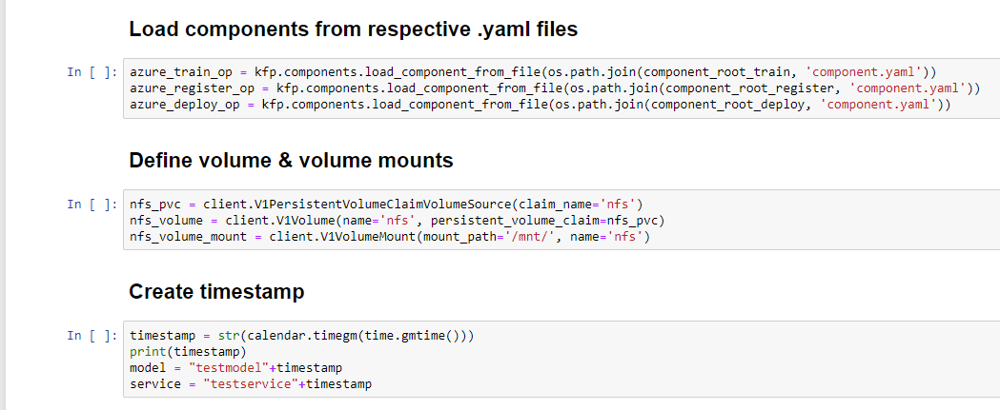
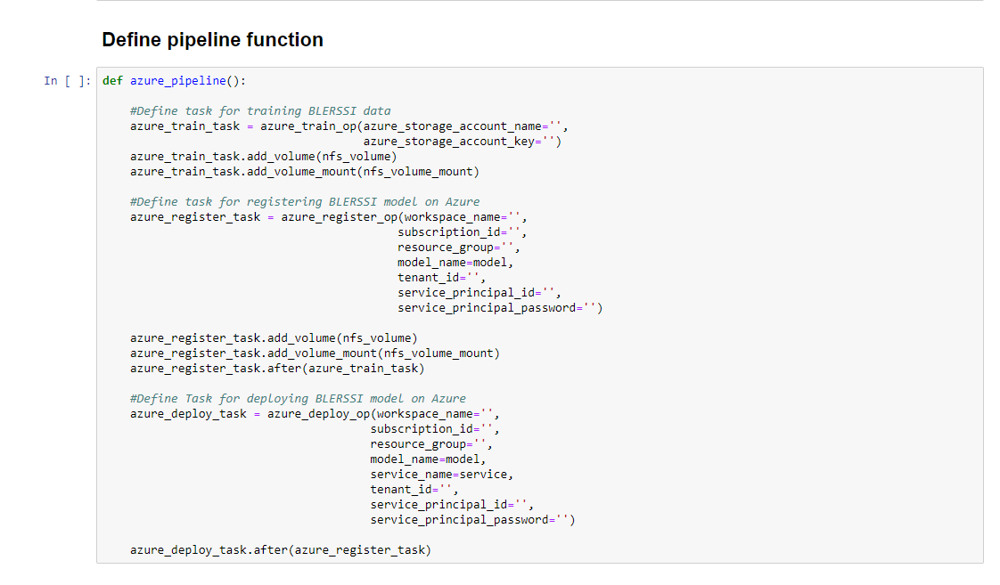
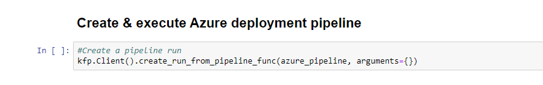
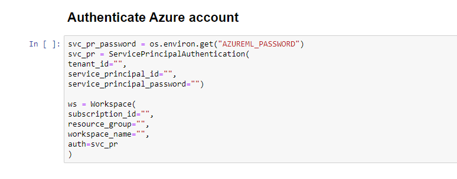
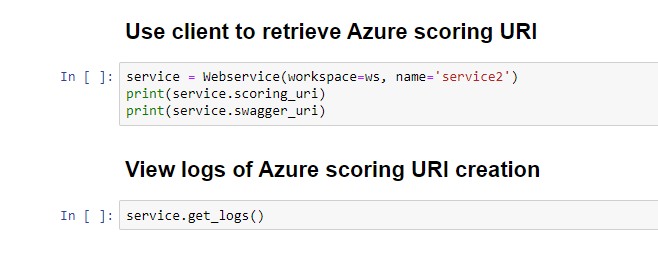
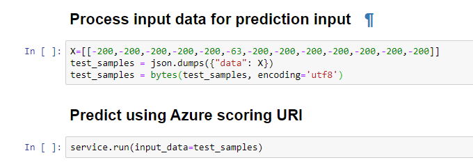

# BLE-RSSI Hybrid Pipeline using Cisco UCS 🤝 Azure ML
<!-- vscode-markdown-toc -->
* [Problem Definition](#ProblemDefinition)
* [Prerequisites](#Prerequisites)
* [Azure Setup](#AzureSetup)
	* [Create Azure ResourceGroup](#CreateResourceGroup)
	* [Create Azure ML Workspace](#CreateMLWorkspace)
	* [Create Azure Service Principal](#CreateServicePrincipal)
* [UCS Setup](#UCSSetup)
	* [Retrieve Ingress IP](#RetrieveIngressIP)
* [Pipeline Workflow](#PipelineWorkflow)
	* [Create Jupyter Notebook Server](#CreateJupyterNotebookServer)
	* [Upload Hybrid Pipeline notebook](#UploadHybridPipelinenotebook)
	* [Run Pipeline](#RunPipeline)
	* [Run Prediction API](#RunPredictionAPI)

<!-- vscode-markdown-toc-config
	numbering=false
	autoSave=true
	/vscode-markdown-toc-config -->
<!-- /vscode-markdown-toc -->

## <a name='ProblemDefinition'></a>Problem Definition
The description of the BLE-RSSI based location prediction problem
can be found [here](../../README.md).

## <a name='Prerequisites'></a>Prerequisites

- [ ] UCS machine with Kubeflow 1.0 installed
- [ ] Azure account with appropriate permissions

The overall solution uses [Kubeflow](https://www.kubeflow.org/) to run
the training on [Cisco UCS](https://www.cisco.com/c/en_in/products/servers-unified-computing/index.html) servers and the model is then served via [Azure ML](https://docs.microsoft.com/en-us/azure/machine-learning/).

## <a name='AzureSetup'></a>Azure Setup
### <a name='CreateResourceGroup'></a>Create Azure ResourceGroup

Create Azure Resource Group. Check [here](https://docs.microsoft.com/en-us/azure/azure-resource-manager/management/manage-resource-groups-portal) for detailed documentation

### <a name='CreateMLWorkspace'></a>Create Azure Machine Learning Workspace

Create Azure ML Worspace inside ResourceGroup. Check [here](https://docs.microsoft.com/en-us/azure/machine-learning/how-to-manage-workspace) for detailed documentation

### <a name='CreateServicePrincipal'></a>Create Service Principal Authentication

Create Azure Resource Group. Check [here](https://docs.microsoft.com/en-us/azure/active-directory/develop/howto-create-service-principal-portal) for detailed documentation


Pipeline and notebook uses azure-secret to get access to azure ML

Make sure you have  `azure-secret` in kubeflow and anonymous namespace.

    echo -n $YOUR_BASE64_WORKSPACE_NAME | base64
    echo -n $YOUR_BASE64_SUBSCRIPTION_ID | base64
    echo -n $YOUR_BASE64_RESOURCE_GROUP | base64
    echo -n $YOUR_BASE64_TENANT_ID | base64
    echo -n $YOUR_BASE64_SERVICE_PRINCIPAL_ID | base64
    echo -n $YOUR_BASE64_SERVICE_PRINCIPAL_PASSWORD | base64
	
	
```yaml
apiVersion: v1
kind: Secret
metadata:
  name: azure-secret
type: Opaque
data:
  WORKSPACE_NAME: YOUR_BASE64_WORKSPACE_NAME
  SUBSCRIPTION_ID: YOUR_BASE64_SUBSCRIPTION_ID
  RESOURCE_GROUP: YOUR_BASE64_RESOURCE_GROUP
  TENANT_ID: YOUR_BASE64_TENANT_ID
  SERVICE_PRINCIPAL_ID: YOUR_BASE64_SERVICE_PRINCIPAL_ID
  SERVICE_PRINCIPAL_PASSWORD: YOUR_BASE64_SERVICE_PRINCIPAL_PASSWORD
```
Apply this yaml in kubeflow and anonymous namespace

```
kubectl apply -f azure-secret.yaml -n kubeflow
kubectl apply -f azure-secret.yaml -n anonymous
```
To configure azure-secrets to kubeflow notebook server, create kind `PodDefault` in anonymous namespace

```yaml
apiVersion: "kubeflow.org/v1alpha1"
kind: PodDefault
metadata:
  name: add-azure-secret
spec:
 selector:
  matchLabels:
    add-azure-secret: "true"
 desc: "Add Azure credentials to notebook server"
 volumeMounts:
 - name: secret-volume
   mountPath: /secret/gcp
 volumes:
 - name: secret-volume
   secret:
    secretName: azure-secret
 env:
 - name: WORKSPACE_NAME
   valueFrom:
     secretKeyRef:
       name: azure-secret
       key: WORKSPACE_NAME
 - name: SUBSCRIPTION_ID
   valueFrom:
     secretKeyRef:
       name: azure-secret
       key: SUBSCRIPTION_ID
 - name: RESOURCE_GROUP
   valueFrom:
     secretKeyRef:
       name: azure-secret
       key: RESOURCE_GROUP
 - name: TENANT_ID
   valueFrom:
     secretKeyRef:
       name: azure-secret
       key: TENANT_ID
 - name: SERVICE_PRINCIPAL_ID
   valueFrom:
     secretKeyRef:
       name: azure-secret
       key: SERVICE_PRINCIPAL_ID
 - name: SERVICE_PRINCIPAL_PASSWORD
   valueFrom:
     secretKeyRef:
       name: azure-secret
       key: SERVICE_PRINCIPAL_PASSWORD
```
Apply this yaml in anonymous namespace

```
kubectl apply -f add-azure-secret.yaml -n anonymous
```

## <a name='UCSSetup'></a>UCS Setup

To install Kubeflow, follow the instructions [here](../../../../../../install)

### <a name='RetrieveIngressIP'></a>Retrieve Ingress IP

For installation, we need to know the external IP of the 'istio-ingressgateway' service. This can be retrieved by the following steps.  

```
kubectl get service -n istio-system istio-ingressgateway
```

If your service is of LoadBalancer Type, use the 'EXTERNAL-IP' of this service.  

Or else, if your service is of NodePort Type - run the following command:  

```
kubectl get nodes -o wide
```

Use either of 'EXTERNAL-IP' or 'INTERNAL-IP' of any of the nodes based on which IP is accessible in your network.  

This IP will be referred to as INGRESS_IP from here on.

## <a name='PipelineWorkflow'></a>Pipeline Workflow
Once the setup is complete, the following are the steps in the pipeline
workflow.

### <a name='CreateJupyterNotebookServer'></a>Create Jupyter Notebook Server

Add configuration as given below to attach azure-secrets while creating new notebook server



Follow the [steps](./../notebook#create--connect-to-jupyter-notebook-server) to create & connect to Jupyter Notebook Server in Kubeflow    
### <a name='UploadHybridPipelinenotebook'></a>Upload Hybrid Pipeline notebook

Upload [blerssi-azure.ipynb](blerssi-azure.ipynb) file to the created Notebook server.
    
### <a name='RunPipeline'></a>Run Pipeline

Open the [blerssi-azure.ipynb](blerssi-azure.ipynb) file and run pipeline

Clone git repository to download components and install required libraries 



Import libraries and declare component files



Load component files and define nfs persistant volume and persistant volume claim



Definition of pipeline function



Deploy pipeline, create pipeline experiment and run 



Declare azure authentication



Check Inference service URL and Inference logs



### <a name='RunPredictionAPI'></a>Run Prediction API

Send prediction request to azure inference service


