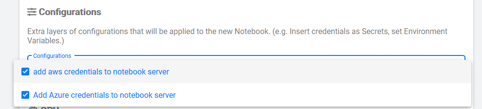
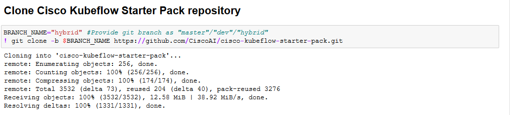
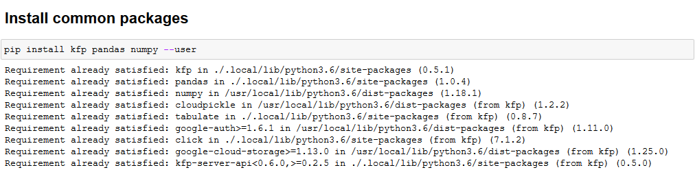
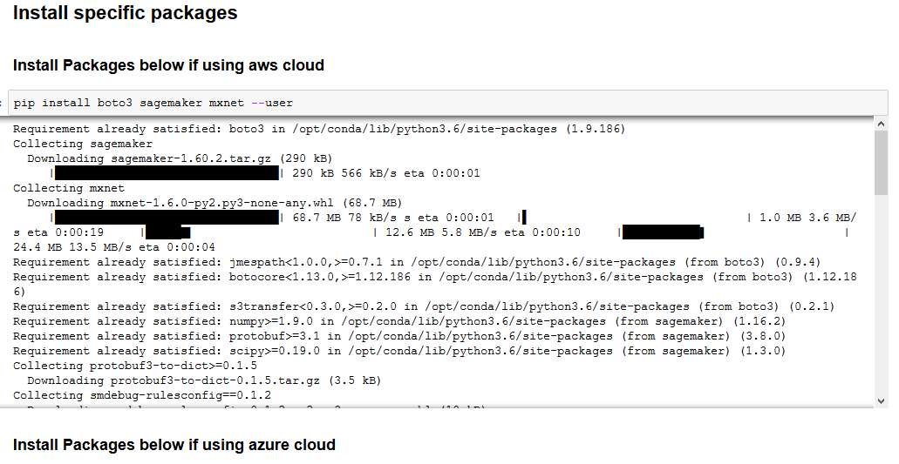
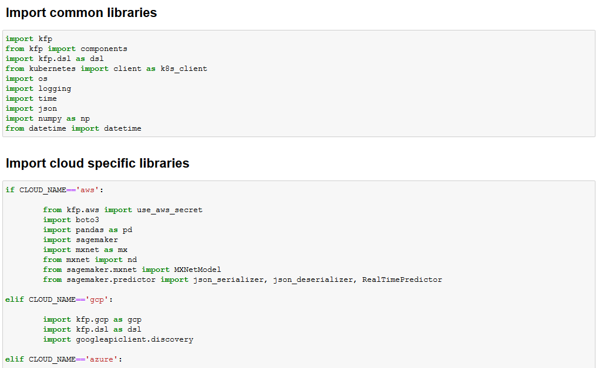
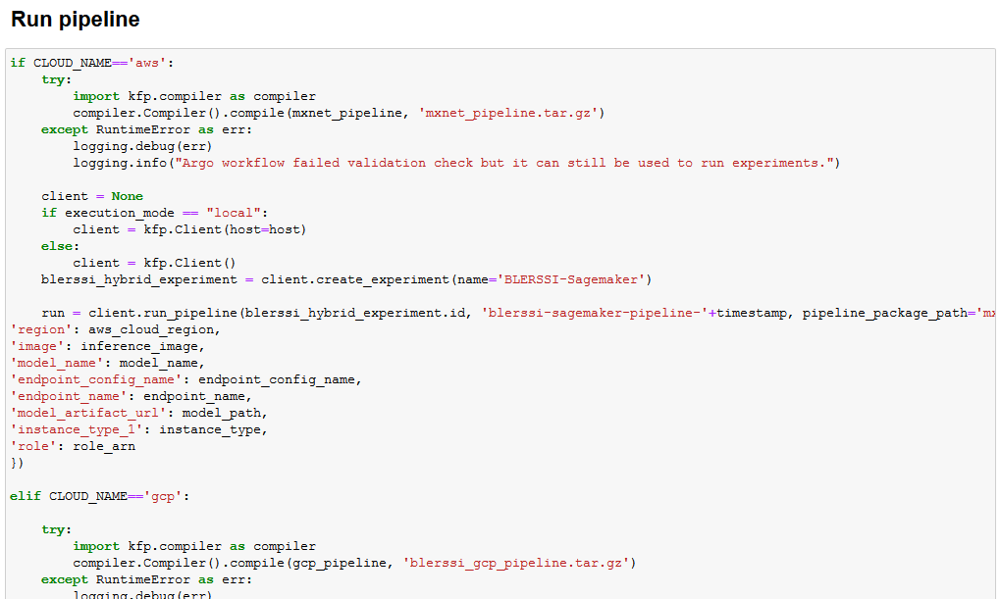
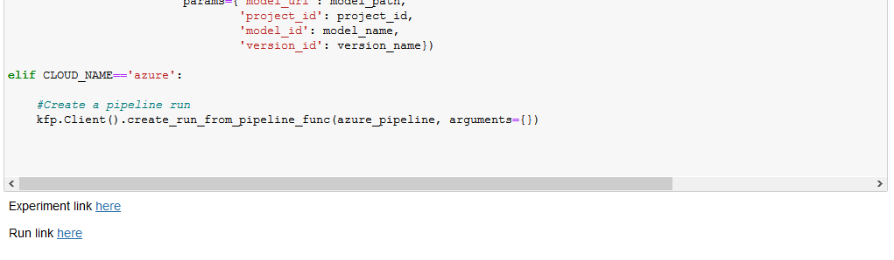
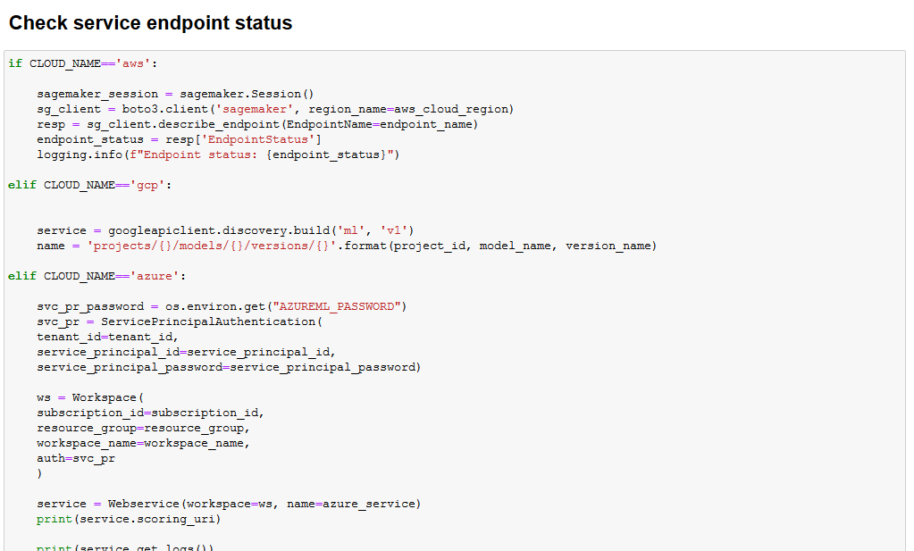

# BLE-RSSI Integrated Hybrid Pipeline 

<!-- vscode-markdown-toc -->
* [Problem Definition](#ProblemDefinition)
* [Prerequisites](#Prerequisites)
* [Solution Schematic](#SolutionSchematic)
* [Cloud Setup](#CloudSetup)
* [UCS Setup](#UCSSetup)
	* [Pipeline Workflow](#PipelineWorkflow)
	* [Create Jupyter Notebook Server](#CreateJupyterNotebookServer)
	* [Upload Integrated Hybrid Pipeline notebook](#UploadIntegratedHybridPipelinenotebook)
	* [Run Pipeline](#RunPipeline)
	
<!-- vscode-markdown-toc-config
	numbering=false
	autoSave=true
	/vscode-markdown-toc-config -->
<!-- /vscode-markdown-toc -->

## Problem Definition
The description of the BLE-RSSI based location prediction problem
can be found [here](../../README.md).

## Prerequisites

- [ ] UCS machine with Kubeflow 1.0 installed
- [ ] Based on the choice of your cloud:
  * AWS account with appropriate permissions
  * GCP account with appropriate permissions
  * Azure account with appropriate permissions 

## Solution Schematic

The overall solution uses [Kubeflow](https://www.kubeflow.org/) to run
the training on [Cisco UCS](https://www.cisco.com/c/en_in/products/servers-unified-computing/index.html) servers and the model is then served via [Amazon SageMaker](https://aws.amazon.com/sagemaker/) in case of AWS cloud, via [GCP AI Platform](https://cloud.google.com/ai-platform/prediction/docs) in case of GCP cloud & via [Azure ML](https://docs.microsoft.com/en-us/azure/machine-learning/) in case of Azure cloud.

## Cloud Setup

To complete the initial setup for selected cloud for deployment, Please refer [AWS Setup](../aws/pipelines#aws-setup), [GCP Setup](../gcp/pipelines#gcp-setup) or [Azure Setup](../azure/pipelines#azure-setup) based on your requirement.

## UCS Setup

To complete UCS setup, Please refer [UCS Setup](../gcp/pipelines#ucs-setup).

## Pipeline Workflow
Once the setup is complete, the following are the steps in the pipeline
workflow.

### Create Jupyter Notebook Server

Add configuration as shown below to attach aws-secrets and/or azure-secrets while creating new notebook server.

Follow the [steps](./../notebook#create--connect-to-jupyter-notebook-server) to create & connect to Jupyter Notebook Server in Kubeflow    
### Upload Integrated Hybrid Pipeline notebook

Upload [blerssi-integrated-hybrid.ipynb](blerssi-integrated-hybrid.ipynb) file to the created Notebook server.
    
### Run Pipeline

Open the [blerssi-integrated-hybrid.ipynb](blerssi-integrated-hybrid.ipynb) file and run pipeline.

Clone the Cisco Kubeflow Starter Pack repository

Install common packages 

Install specific packages related to your choice of cloud

Set Name of the cloud you wish to use for model deployment

Import libraries 

:information_source: 
### Building inference image if using aws cloud
  
   Run build & push script [here](../aws/pipelines/components/v1/mxnet-byom-inference/container/build_and_push.sh) using your *account credentials*.

Set timestamp

Set common parameters (common for GCP & AWS clouds)

Set specific parameters for required cloud

Validate whether the required parameters are set

Load components 

Define pipeline functions

Run pipeline functions

Click on the Run link as shown below to view your pipeline that is executing

Wait until the pipeline execution is complete. (sample pipeline for aws cloud is shown)

 

Check service endpoint status deployed on the chosen cloud

Predict using service endpoint

Clean up resources after prediction

